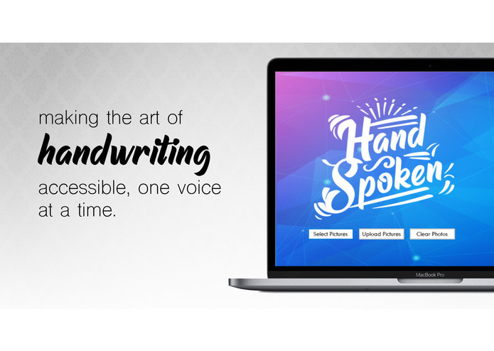

# Hand Spoken

## Inspiration
Handwriting is such a beautiful form of art that is unique to every person, yet unfortunately, it is not accessible to everyone.

Parkinson’s affects nearly 1 million people in the United States and more than 6 million people worldwide. For people who struggle with fine motor skills, picking up a pencil and writing is easier said than done. We want to change that.

We were inspired to help people who find difficulty in writing, whether it be those with Parkinson's or anyone else who has lost the ability to write with ease. We believe anyone, whether it be those suffering terminal illnesses, amputated limbs, or simply anyone who cannot write easily, should all be able to experience the joy of writing!

## What it does
Hand Spoken is an innovative solution that combines the ease of writing with the beauty of an individual's unique handwriting.

All you need to use our desktop application is an old handwritten letter saved by you! Simply pick up your paper of handwriting (or handwriting of choice) and take a picture. After submitting the picture into our website database, you are all set. Then, simply speak into the computer either using a microphone or a voice technology device. The user of the desktop application will automatically see their text appear on the screen in their own personal handwriting font! They can then save their message for later use.

## How we built it
We created a desktop application using C# with Visual Studio's WinForm framework. Handwriting images uploaded to the application is sent via HTTP request to the backend, where a python server identifies each letter using pytesseract. The recognized letters are used to generate a custom font, which is saved to the server. Future audio files recorded by the frontend are also sent into the backend, at which point AWS Transcribe services are contacted, giving us the transcribed text. This text is then processed using the custom handwriting font, being eventually returned to the frontend, ready to be downloaded by the user.

## Challenges we ran into
One main challenge our team ran into was working with pytesseract. To overcome this obstacle, we made sure we worked collaboratively as a team to divide roles and learn how to use these exciting softwares.

## Accomplishments that we're proud of
We are proud of creating a usable and functional database that incorporates UX/UI design!

## What we learned
Not only did we learn lots about OCR (Optical Character Recognition) and AWS Transcribe services, but we learned how to collaborate effectively as a team and maximize each other's strengths.

## What's next for Hand Spoken
Building upon on our idea and creating accessibility for all through the use of technology!

Find the frontend [here](https://github.com/alexz429/hand-spoken-cs)
